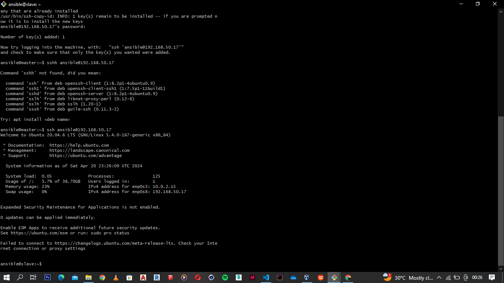
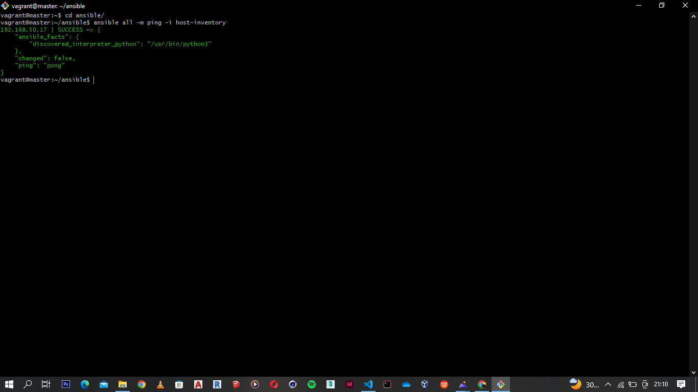

# Automating the deployment of a LAMP (Linux, Apache, MySQL, PHP) stack using a Bash script within Ansible.

# Objective
The objective of this project is to automate the deployment of a LAMP (Linux, Apache, MySQL, PHP) stack using a Bash script within Ansible. The automation includes provisioning two Ubuntu-based servers, named "Master" and "Slave", using Vagrant, executing a Bash script on the Master node to deploy the LAMP stack, and using Ansible to automate tasks on the Slave node, such as executing the Bash script and setting up a cron job.

# Deployment Steps

### Automated provisioning of master and slave nodes with vagrant
Vagrant file configured to provision two virtual machines, Master and Slave, with specified IP addresses and password authentication enabled. 


### LAMP Script Execution on Master VM
A Bash script was created to automate the installation of the LAMP stack and necessary dependencies on the Master VM. The script also configured Apache web server and MySQL.
Content of LAMP script [here](lamp.sh)

Sceenshot below shows the successful execution of the script. 


### Accessing Laravel page with master IP
The Laravel page was accessed using the IP address of the Master VM to verify the successful deployment of the PHP application.


### SSH Keys Generation for SSH Connectivity
Using the ```ssh-keygen``` command on master VM, ssh keys were generated to enable ssh connectivity between both virtual machines. Successful SSH connectivity to the Slave VM from the Master VM was verified.



### Ansible Configuration and Ping Test 
Ansible was configured on the Master VM, and the Slave VM IP was added to the custom host inventory file. A ping test was performed to verify connectivity to the Slave VM using Ansible.



###  Execution of Playbook on Slave Node
Ansible playbook to run the LAMP script on the slave node and set up a cron job was created. The contents can be seen [here](playbook.yaml). All plays were executed successfully.


### Accessing Laravel Page with Slave IP
The Laravel page was accessed using the IP address of the Slave VM to confirm the successful execution of the Bash script with Ansible.


### Crontab set on slave node
Play to set cronjob also properly set up.

