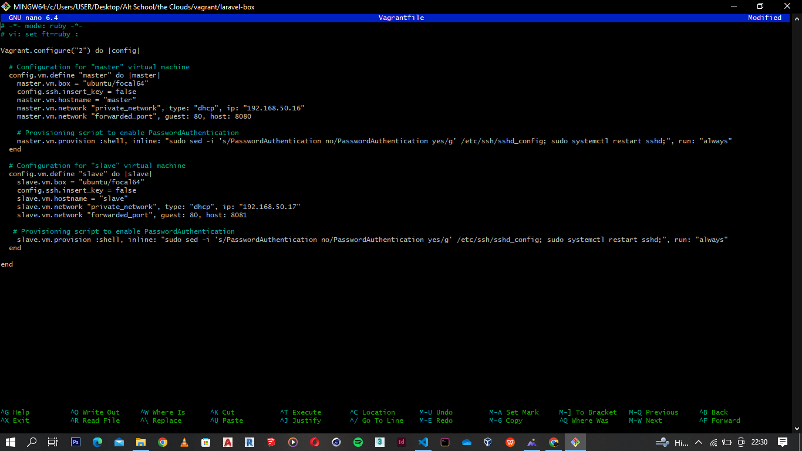

# Automated provisioning of master and slave nodes

# Script successfully executed on master server

# Laravel page with master IP

# Playbook executed on slave node

# Laravel page with slave IP

# Crontab set on slave node
